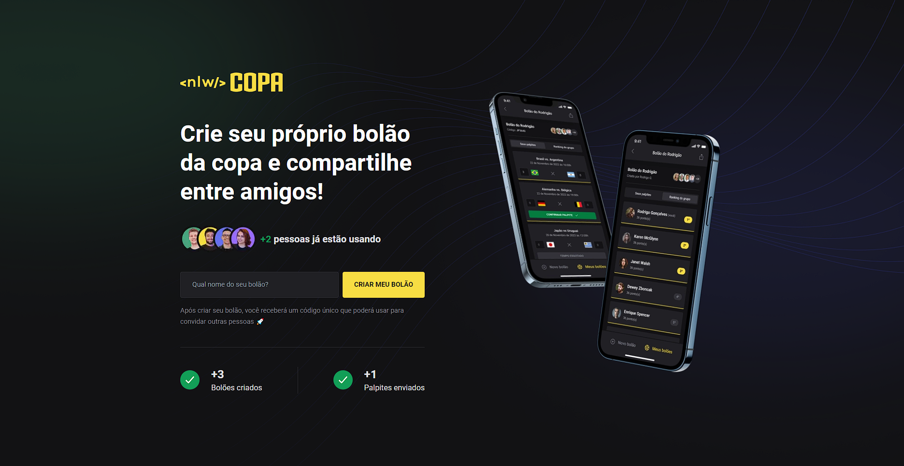
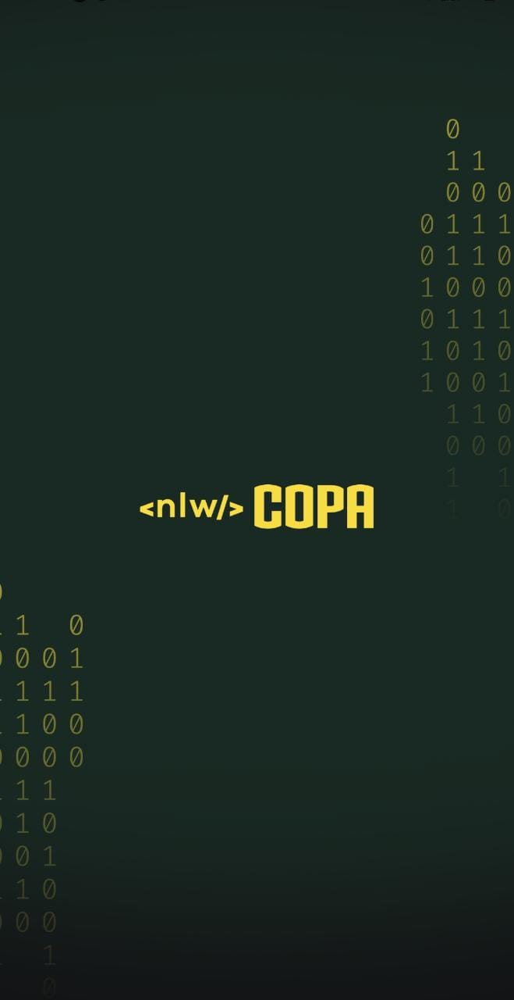
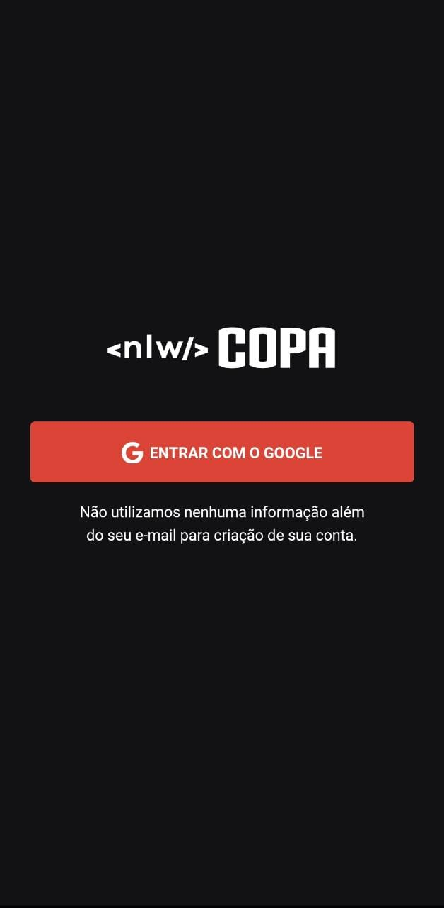
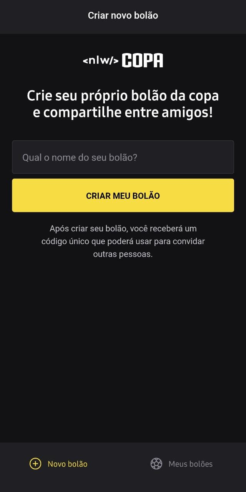
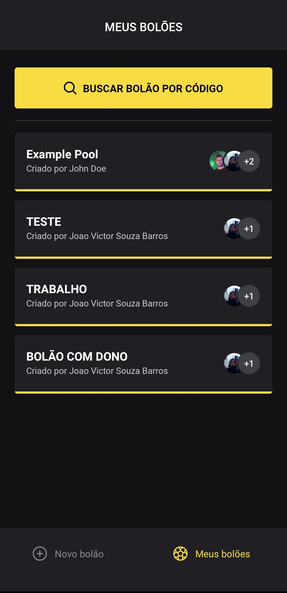
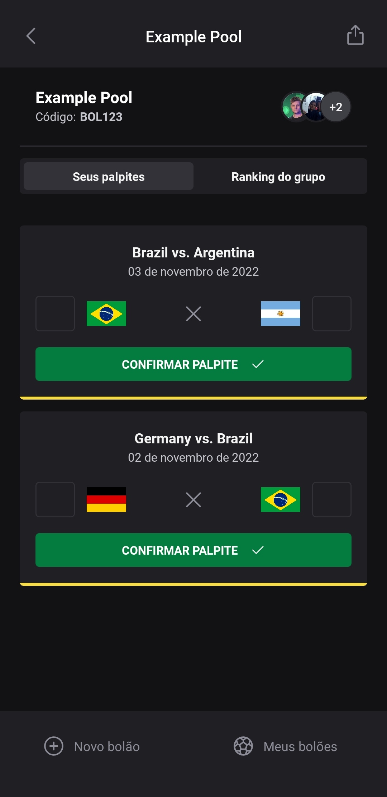

# NLW COPA IGNITE 2022 - Aplicação Mobile e Web

Projeto desenvolvida durante o evento NLW Copa da Rocketseat.

Dentro dessa aplicação é possível:

- A criação de bolão.
- Logar com o Google (exclusivo da versão Mobile).
- Participar de bolões já criados através do código do bolão.
- Compartilhar o código dos bolões com amigos.

<h2 style="font-weight:bold"> BACKEND (SERVER) </h2>

Aplicação backend do projeto construído usando Node, Fastify, Prisma, SQLite.


## RODAR APLICAÇÃO BACKEND

Abra terminal de comando dentro da pasta.

- Instale as dependências

```bash
  npm install
```

- crie um arquivo .env e coloque dentro:

```bash
   DATABASE_URL="file:./dev.db"
```

- migre o banco de dados

```bash
   npx prisma migrate dev
```

- Inicie o servidor

```bash
  npm run dev
```

<hr>

<h2 style="font-weight:bold"> FRONT-END (WEB) </h2>

Aplicação frontend do projeto construído utilizando React, Next.js, Typescript, TaildwindCSS.




## RODAR APLICAÇÃO FRONTEND

Após iniciar o backend/servidor, abra o terminal de comando dentro da pasta web e execute os seguintes comandos.

- Instale as dependências

```bash
  npm install
```

- Iniciar aplicação

```bash
  npm run dev
```

A página abrirá no endereço:

> http://localhost:3000

Dados em tela refletem os dados do banco de Dados, conforme os bolões forem sendo criados o número na tela será atualizado.

<hr>

<h2 style="font-weight:bold">MOBILE</h2>

Aplicação mobile do projeto construído utilizando React Native, Expo, Native-base.


<div style="display:flex; flex-wrap: wrap; gap: 20px; justify-content: center;">
  
  
  
  
  
</div>
<br>

## RODAR APLICAÇÃO MOBILE

Após iniciar o backend/servidor, abra o terminal de comando na pasta mobile.

Você deve ter android studio para poder emular um ambiente android ou instalar EXPO
GO da Googleplay store ou Applestore.

- Instale as dependências

```bash
  npm install
```

- Inicie a aplicação

```bash
  npx expo start
```

Após a aplicação ser iniciada você tem a opção de ou abrir pelo emulador do Android studio ou lendo o QR Code através do Expo GO.

> Obs: Para a aplicação Mobile é necessário que você tenha uma variavel de ambiente. CLIENT_ID

<hr>
